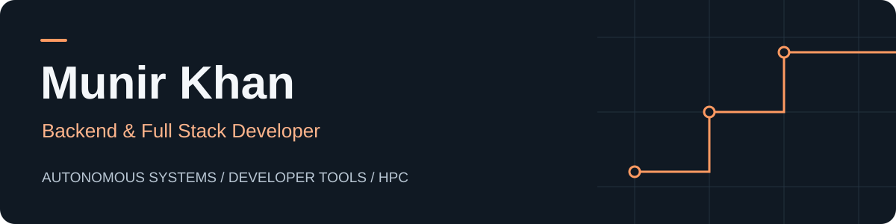
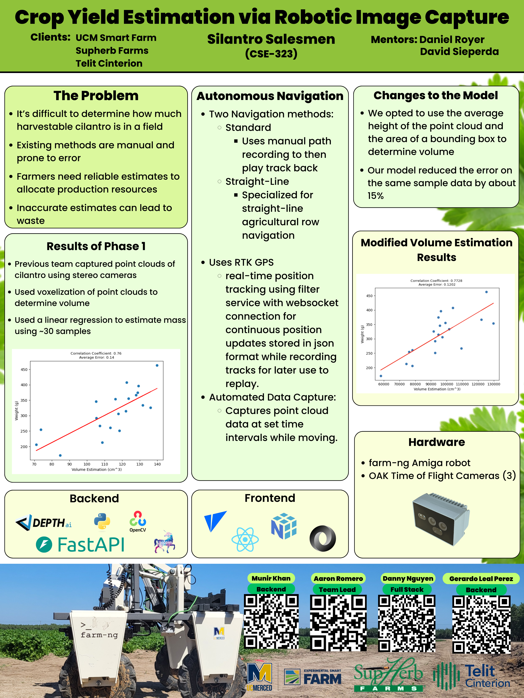
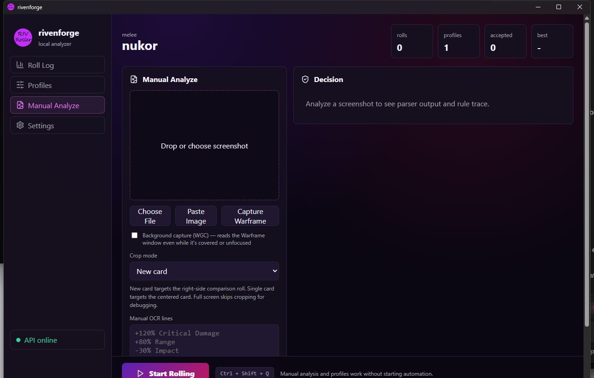
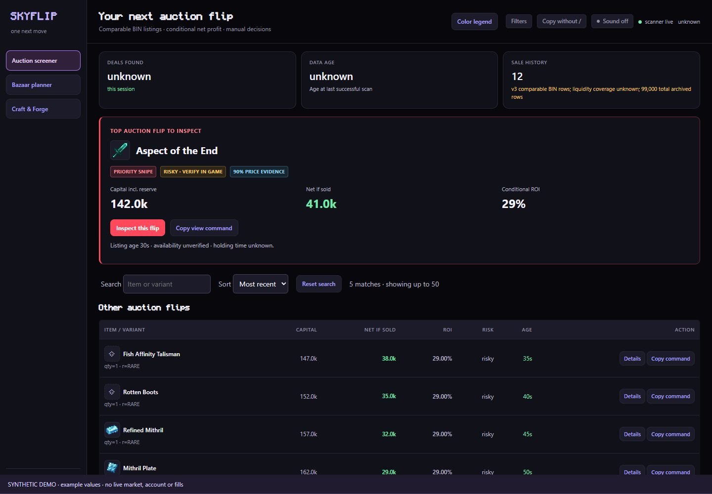
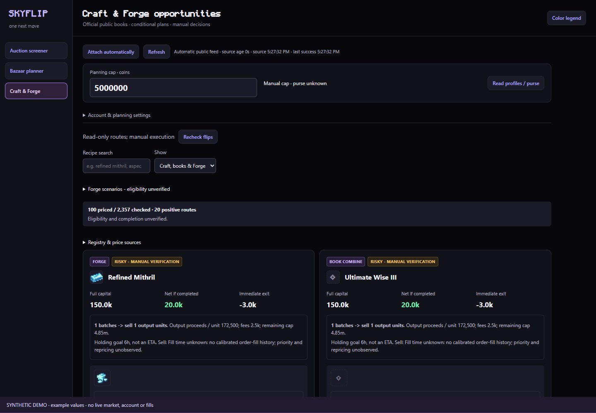
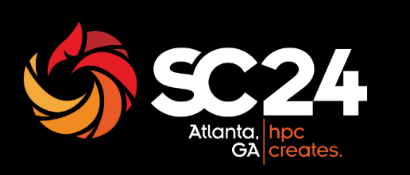

  <a href="mailto:munirk79@gmail.com">Email me</a> &nbsp; / &nbsp;
  <a href="https://github.com/munir-a-khan?tab=repositories">Explore my repositories</a> &nbsp; / &nbsp;
  <a href="#selected-work">Selected work</a>

# Hi, I'm Munir.

I'm a Computer Science & Engineering graduate from **UC Merced**, building backend services, full-stack applications, and automation tools. My work spans agricultural robotics, Windows desktop software, and performance tuning on multi-node clusters.

I enjoy the engineering between an idea and a usable tool: processing live data, connecting APIs to interfaces, and making systems easier to operate.

## Selected work

### AMIGA · Autonomous agricultural robotics

**Backend & Full Stack Developer · UC Merced capstone with SupHerb Farms**

An autonomous navigation system for cilantro crop yield estimation, built around the Farm-ng Amiga robot.

- Connected real-time camera processing, GPS tracking, and LINE-based navigation.
- Built backend and frontend functionality for operating the system.
- **Top finisher, Track 6 — I2G Capstone.**

`FastAPI` `React` `TypeScript` `WebSockets` `Multiprocessing`

*Original capstone poster: navigation, image capture, yield estimation, and the robot in the field. Open the image to read the full poster.*

### [rivenforge](https://github.com/munir-a-khan/rivenforge) · Desktop analysis & automation

**Solo Developer · Windows desktop application**

*Actual desktop interface from the project documentation, shown before an image is analyzed.*

A Warframe riven analyzer and roller with a React interface, Tauri desktop shell, and local FastAPI backend.

- Combines deterministic name decoding with OCR to read riven stats.
- Evaluates rolls against user-defined rules, with retrieval and live-market scoring for context.
- Supports window capture while the game is covered or unfocused; automated rolling stays foreground-only.

`Tauri 2` `React` `TypeScript` `FastAPI` `WinRT OCR` `Docker`

[Explore the code →](https://github.com/munir-a-khan/rivenforge)

### [SkyFlip](https://github.com/munir-a-khan/skyblock-auction-engine) · Minecraft SkyBlock planning

**In development · Local inspection and manual planning**

*Auction inspection with conditional capital and net-if-sold estimates. Synthetic fixture example; availability and completion remain unverified.*

*Craft & Forge routes with conditional fees and capital, explicit uncertainty, and manual execution. Images show synthetic fixture examples.*

SkyFlip brings local **Auction inspection, Bazaar order planning, and Craft & Forge routes** into one interface. It presents conditional estimates and their unknowns to support manual decisions; these demo images show no live market, account, or executed fills.

[Explore the feature tour →](https://github.com/munir-a-khan/skyblock-auction-engine/blob/0ef1630d799fef5e907454218e0b00f916b40a57/docs/FEATURE_TOUR.md)

### [Job Search Command Center](https://github.com/munir-a-khan/job-search-command-center) · AI-assisted workflow

**Full-Stack Developer · Web application**

A single workspace for the job-search process: job-description parsing, resume tailoring, cover-letter generation, and application tracking.

- Connects a React interface to a FastAPI backend and the Claude API.
- Packages the application with Docker for repeatable setup.

`React` `TypeScript` `FastAPI` `Claude API` `Docker`

[Explore the code →](https://github.com/munir-a-khan/job-search-command-center)

### IndySCC 2024 · High-performance computing

**Performance Tuning Specialist · Student Cluster Competition**

*SC24 event identity restored from the earlier portfolio; this is the conference logo.*

Optimized High-Performance Linpack benchmarks on multi-node clusters through compiler flags and MPI configuration tuning.

`HPL` `OpenMPI` `SLURM` `NAMD`

## More projects & research

These projects have private repositories; summaries are included here for context.

| Project | Focus |
| :--- | :--- |
| **Warframe Market Sniper** | Auction monitoring with staggered polling, stat grading, Discord/Telegram alerts, and SQLite metrics. Built with Node.js and discord.js. |
| **WF Omni Tile Roller** | Python/Tkinter prototype that scans live game logs for tile identification and user-labeled room data. |
| **IRC Protocol Research** | Packet inspection, TLS authentication flows, and network protocol analysis with Wireshark and Burp Suite. |

## Tools I work with

| Area | Technologies |
| :--- | :--- |
| **Languages** | Python, TypeScript, JavaScript, Java, Bash, HTML/CSS |
| **Backend & data** | FastAPI, Node.js, WebSockets, SQLite, Redis, MongoDB |
| **Interfaces & desktop** | React, Tailwind CSS, Tauri, Tkinter |
| **Automation & systems** | discord.py, discord.js, python-telegram-bot, Docker, Git |
| **Research & performance** | OpenMPI, SLURM, Wireshark, MATLAB, Jupyter |

## Education

**University of California, Merced** 
B.S. in Computer Science & Engineering

Coursework in algorithms, software engineering, computer vision, artificial intelligence, machine learning, human-computer interaction, probability and statistics, and numerical methods.

---

Interested in my work in backend development, robotics, or automation? **[Let's connect.](mailto:munirk79@gmail.com)**
